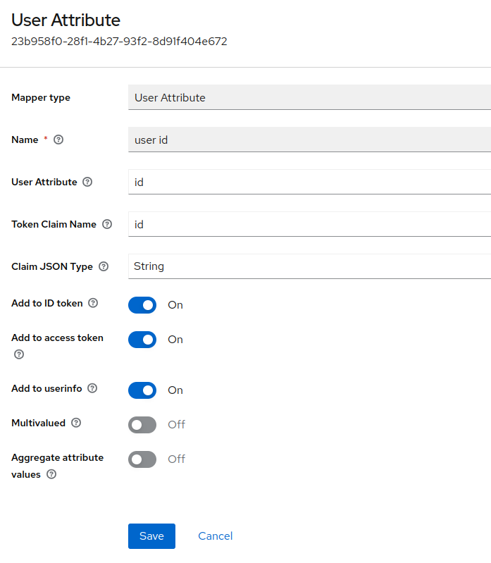

# Keycloak server for Gaia-X Wizard application

This project is used to set a custom Keycloak theme for the Wizard application. To provide a ready-to-use setup, 
a docker compose file has been added which spins up the following services:
- **Postgres:** To persist keycloak data
- **Keycloak:** Main application to manage user authentication
- **Mailhog:** SMTP server for test emails

## Getting Started:
- To redirect users to Wizard's UI after they complete registering their WebAuthn device, 
add the login URL as `RESTART_LOGIN_URL` in environment variable. 
- To run the above-mentioned docker-compose, run the below command to deploy the services:
```bash
docker-compose up
```
- Now, create a new realm from the keycloak admin panel. We will use this realm in our Wizard application.
- Next, in the 'Authentication' tab, create a copy of the 'browser' flow and customize the copy as shown below to set up
sign in through webAuthn: \
  
- To configure the email configuration, go to the 'Email' tab under 'Realm settings'. If mailhog server is being used, 
the configuration look like below: \
  
- Click on 'Test connection' to confirm that the provided values are correct.
- Create a public client that will be used by frontend for signing in to the application. Go to the advanced tab to 
override the browser flow to the one created in the previous step.
- In the 'Client scopes' tab, create a new client scope. Create a new 'User Attribute' mapper in this. 
This mapper will map user's ID in the Wizard application to their access token. \
  


## Configuring a confidential client for the Wizard application:
- Next, we will need to configure a private client that will manage users, send emails, and assign client role to 
the users.
- After providing a relevant client id to this client, enable client authentication and grant service account roles to 
this client.
- Go to 'Service account roles' tab and assign below client roles to this client:
  - view-clients
  - manage-users
  - view-realm
  - manage-authentication
- Navigate to the 'Roles' tab to create a new role 'participant'.

### Updating CSS:
To update the style file, go to themes/gaiax/login/resources/styles/ directory and update `.scss` file. 
Use the command below to convert the SCSS file to CSS file. Do not make any changes to the CSS file.

```bash
node-sass styles.scss styles.css --watch
```